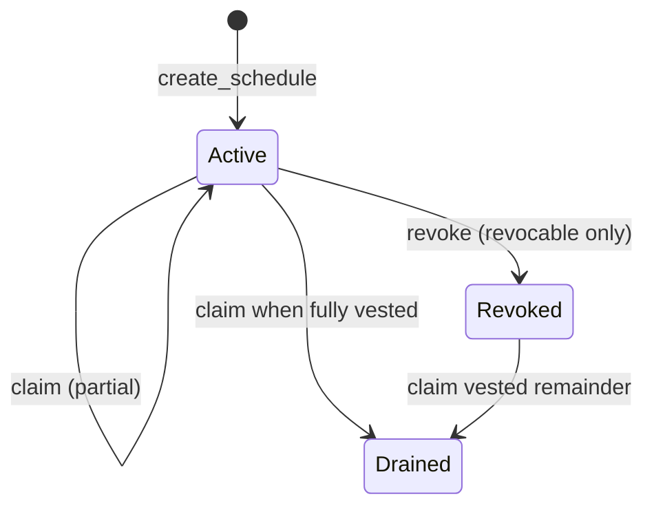

# Architecture

## Goals

1. Hold tokens for many beneficiaries in one contract without any schedule being able to
   affect another.
2. Make the money rules small enough to verify by reading: one pure function decides how much
   has vested, and everything else is bookkeeping around it.
3. Never lose a schedule to storage expiry through neglect.

## Data model

```
Instance storage                      Persistent storage
----------------                      ------------------
DataKey::Count  -> u64                DataKey::Schedule(id) -> Schedule
```

`Count` is the next schedule id. Ids are sequential, start at 0 and are never reused.

`Schedule` fields: `funder`, `beneficiary`, `token`, `total`, `claimed`, `start`, `cliff`,
`end`, `revocable`, `revoked`, `vested_at_revoke`.

Schedules live in **persistent** storage because each is independent state that must outlive
the shared instance entry; the counter is tiny and always needed, so it lives in **instance**
storage.

## Vesting math (`math.rs`)

```
vested(total, start, cliff, end, now) =
    0                                     if now < cliff
    total                                 if now >= end
    floor(total * (now - start) / (end - start))   otherwise
```

Properties (checked by unit and property tests):

- `0 <= vested <= total`
- non-decreasing in `now`
- jumps from 0 to the linear amount at the cliff, not to `total`
- multiplication uses `checked_mul`; overflow returns `Error::MathOverflow`
- rounding is always down, so the contract can never owe more than it holds

Worked example, 1,000 tokens, `start=0`, `cliff=25d`, `end=100d`:

| Time | Vested |
|---|---|
| day 24 | 0 |
| day 25 | 250 |
| day 50 | 500 |
| day 100 and later | 1,000 |

### Floor rounding with indivisible intervals

Arithmetic uses integer division, truncating down (`floor`). The contract can never over-pay or owe more than it holds because:
1. For any `now < end`, `elapsed < duration`, so `floor(total * elapsed / duration) < total`.
2. When `now >= end`, the branch returns `total` exactly, unlocking any remainder that was truncated during linear steps.

#### Example 1: 10 tokens over 3 seconds (`start=0`, `cliff=0`, `end=3`)
Matches `math::tests::linear_in_the_middle_and_rounds_down` (`vested(10, 0, 0, 3, 1) == Ok(3)`):

| Time (`now`) | Formula | Exact fraction | `vested` (floor) | Incremental new | Notes |
|---|---|---|---|---|---|
| 0s | `10 * 0 / 3` | 0.0 | 0 | 0 | Start of schedule |
| 1s | `10 * 1 / 3` | 3.333... | 3 | +3 | Truncated down from 3.333... |
| 2s | `10 * 2 / 3` | 6.666... | 6 | +3 | Truncated down from 6.666... |
| 3s and later | `now >= end` | 10.0 | 10 | +4 | Fully vested, capturing remainder |

At 1s, the beneficiary can claim 3 tokens. At 2s, they can claim 3 more (6 total). At 3s, the final 4 tokens vest. At every step prior to completion, cumulative claims remain strictly below theoretical linear vesting (`3 <= 3.33` and `6 <= 6.67`), guaranteeing contract solvency at every timestamp.

#### Example 2: Cliff with fractional vesting (100 tokens, `start=0`, `cliff=3s`, `end=7s`)

| Time (`now`) | Formula | Exact fraction | `vested` (floor) | Notes |
|---|---|---|---|---|
| 2s | `now < cliff` | 0.0 | 0 | Cliff not reached |
| 3s | `100 * 3 / 7` | 42.857... | 42 | Cliff unlocks linear portion rounded down |
| 5s | `100 * 5 / 7` | 71.428... | 71 | Rounding down avoids early over-distribution |
| 7s and later | `now >= end` | 100.0 | 100 | Final settlement |

## State machine of a schedule



After revocation `vested_at_revoke` is frozen. `vested_amount` returns it forever, so time
passing no longer vests anything.

## Flows

**create_schedule**: auth funder, validate, write schedule, bump counter, extend TTL,
*then* transfer `amount` from funder to the contract, emit `ScheduleCreated`.

**claim**: load, auth beneficiary, compute `vested - claimed`, reject if zero, write
`claimed`, extend TTL, *then* transfer to beneficiary, emit `Claimed`.

**revoke**: load, auth funder, require revocable and not already revoked, compute vested,
freeze it, extend TTL, *then* refund `total - vested` to funder, emit `Revoked`.

State is always written before the token call (checks, effects, interactions). If the token
call fails, the whole invocation reverts, so there is no partial state.

## Storage lifetime (TTL) policy

| Entry | Extended by | Bumped to | When fewer than |
|---|---|---|---|
| Instance | `create_schedule`, `claim`, `revoke`, `bump` | ~30 days | ~29 days remain |
| `Schedule(id)` | `create_schedule` (own id), `claim`, `revoke`, `bump` | ~90 days | ~89 days remain |

Read-only views do not extend TTL, so they stay free of write cost in simulation.
Because every state-changing entrypoint and the permissionless `bump` extend **both** entries,
anyone interested in a schedule (beneficiary, funder, an indexer) can keep it alive.
Constants live in `storage.rs`; the test
`every_state_changing_entrypoint_extends_instance_and_schedule_ttl` pins the behaviour.

Soroban archives (does not delete) expired persistent entries, and they can be restored, but
restoring costs a transaction, so the policy above avoids needing it.

## Authorization

| Entrypoint | Required signer |
|---|---|
| `create_schedule` | funder (plus the token's own transfer auth, covered by the same signature) |
| `claim` | beneficiary |
| `revoke` | funder |
| `bump`, views | none |

There is no admin, owner, upgrade key or pause switch. The contract's behaviour cannot be
changed after deployment by anyone.

## Events

| Event | Topics | Data |
|---|---|---|
| `ScheduleCreated` | `id`, `beneficiary` | `funder`, `token`, `amount`, `start`, `cliff`, `end`, `revocable` |
| `Claimed` | `id`, `beneficiary` | `amount` |
| `Revoked` | `id`, `funder` | `refunded`, `vested` |

## Design decisions

- **Pull over push.** The beneficiary claims; no one needs to run a scheduler.
- **Per-schedule token.** Each schedule names its token, so one contract can vest several
  assets, and a misbehaving token can only affect schedules that use it.
- **No admin.** Removing privileged roles removes a whole class of risk. The funder's only
  power is over its own revocable schedules.
- **Pure math module.** Keeps the one piece of arithmetic that matters testable without a
  ledger environment.
